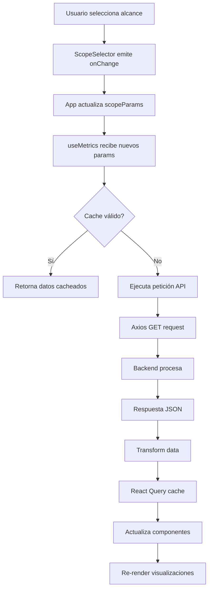

# Arquitectura del Sistema

## Tabla de Contenidos

- [Visión General](#visión-general)
- [Arquitectura de Alto Nivel](#arquitectura-de-alto-nivel)
- [Arquitectura Frontend](#arquitectura-frontend)
- [Flujo de Datos](#flujo-de-datos)
- [Componentes Principales](#componentes-principales)
- [Gestión de Estado](#gestión-de-estado)
- [Sistema de Tipos](#sistema-de-tipos)
- [Patrones de Diseño](#patrones-de-diseño)
- [Decisiones Arquitectónicas](#decisiones-arquitectónicas)

---

## Visión General

**SentimentInsight UAM Dashboard** es una aplicación frontend moderna construida con React que consume la API REST del ecosistema SentimentInsight UAM para visualizar métricas de análisis de sentimientos sobre opiniones estudiantiles.

### Ecosistema SentimentInsight UAM

Este dashboard es parte de un ecosistema más amplio:

```
┌─────────────────────────────────────────────────────────┐
│                  ECOSISTEMA SentimentInsightUAM         │
├─────────────────────────────────────────────────────────┤
│                                                          │
│  ┌────────────────┐        ┌────────────────┐          │
│  │ SentimentInsight│◄──────┤ SentimentInsight│          │
│  │ UAM_SCRAPER     │       │ UAM_NLP         │          │
│  │ (Extracción)    │       │ (Procesamiento) │          │
│  └────────┬────────┘       └────────▲────────┘          │
│           │                         │                   │
│           │        ┌────────────────┴────────┐          │
│           └───────►│ SentimentInsightUAM     │          │
│                    │ (API Backend)           │          │
│                    │ FastAPI + PostgreSQL    │          │
│                    └────────┬────────────────┘          │
│                             │                           │
│                             │ REST API                  │
│                             ▼                           │
│                    ┌────────────────────────┐           │
│                    │ SentimentInsightUAM    │           │
│                    │ _DASHBOARD             │◄────YOU   │
│                    │ (Frontend)             │           │
│                    │ React + TypeScript     │           │
│                    └────────────────────────┘           │
└─────────────────────────────────────────────────────────┘
```

**Responsabilidades:**
- **SCRAPER**: Extracción de datos desde fuentes
- **NLP**: Procesamiento y análisis de sentimientos
- **API**: Almacenamiento y exposición de datos
- **DASHBOARD**: Visualización interactiva

---

## Arquitectura de Alto Nivel

### Stack Tecnológico

```
┌──────────────────────────────────────────────────┐
│                  TECH STACK                      │
├──────────────────────────────────────────────────┤
│                                                  │
│  Framework:       React 18.2.0                  │
│  Lenguaje:        TypeScript 5.2.2              │
│  Build Tool:      Vite 5.0.8                    │
│  Estilos:         Tailwind CSS 3.3.6            │
│  Estado Servidor: React Query 3.39.3            │
│  HTTP Client:     Axios 1.6.2                   │
│  Gráficos:        Recharts 2.10.3               │
│  Word Cloud:      react-wordcloud 1.2.7         │
│                                                  │
└──────────────────────────────────────────────────┘
```

### Diagrama de Capas

```
┌─────────────────────────────────────────────────────────┐
│                    PRESENTATION LAYER                   │
│  ┌──────────────────────────────────────────────────┐  │
│  │  Components (UI)                                  │  │
│  │  - KPICards, SentimentPie, TrendChart, etc.      │  │
│  └──────────────────────────────────────────────────┘  │
└────────────────────────┬────────────────────────────────┘
                         │
┌────────────────────────▼────────────────────────────────┐
│                    BUSINESS LOGIC LAYER                 │
│  ┌──────────────────────────────────────────────────┐  │
│  │  Custom Hooks                                     │  │
│  │  - useMetrics, useCatalog, useTheme              │  │
│  └──────────────────────────────────────────────────┘  │
│  ┌──────────────────────────────────────────────────┐  │
│  │  Context Providers                                │  │
│  │  - ThemeContext                                   │  │
│  └──────────────────────────────────────────────────┘  │
└────────────────────────┬────────────────────────────────┘
                         │
┌────────────────────────▼────────────────────────────────┐
│                    DATA ACCESS LAYER                    │
│  ┌──────────────────────────────────────────────────┐  │
│  │  React Query                                      │  │
│  │  - Cache, refetch, invalidation                  │  │
│  └──────────────────────────────────────────────────┘  │
│  ┌──────────────────────────────────────────────────┐  │
│  │  Axios Client                                     │  │
│  │  - HTTP requests, interceptors                   │  │
│  └──────────────────────────────────────────────────┘  │
└────────────────────────┬────────────────────────────────┘
                         │
                         │ REST API
                         ▼
              ┌──────────────────────┐
              │  Backend API         │
              │  (SentimentInsightUAM)│
              └──────────────────────┘
```

---

## Arquitectura Frontend

### Estructura de Directorios

```
SentimentInsightUAM_DASHBOARD/
│
├── public/                    # Archivos estáticos
│   └── vite.svg              # Favicon
│
├── src/                       # Código fuente
│   ├── api/                   # Cliente API
│   │   └── client.ts         # Configuración Axios
│   │
│   ├── components/            # Componentes React
│   │   ├── KPICards.tsx      # Tarjetas de métricas clave
│   │   ├── ScopeSelector.tsx # Selector jerárquico de filtros
│   │   ├── SentimentPie.tsx  # Gráfico circular de sentimientos
│   │   ├── CategoryPies.tsx  # Gráficos de categorías
│   │   ├── TrendChart.tsx    # Gráfico de tendencias
│   │   ├── WordCloudComp.tsx # Nube de palabras
│   │   └── ThemeToggle.tsx   # Botón cambio de tema
│   │
│   ├── context/               # Contextos de React
│   │   └── ThemeContext.tsx  # Proveedor de tema
│   │
│   ├── hooks/                 # Custom hooks
│   │   ├── useMetrics.ts     # Hook para métricas
│   │   └── useCatalog.ts     # Hook para catálogos
│   │
│   ├── styles/                # Estilos globales
│   │   └── index.css         # CSS global + Tailwind
│   │
│   ├── types.ts               # Definiciones TypeScript
│   ├── App.tsx                # Componente raíz
│   ├── main.tsx               # Punto de entrada
│   └── vite-env.d.ts          # Tipos de Vite
│
├── docs/                      # Documentación
│   ├── ARCHITECTURE.md        # Este archivo
│   ├── DEVELOPMENT.md         # Guía de desarrollo
│   └── API_INTEGRATION.md     # Documentación de API
│
├── .env.example               # Variables de entorno ejemplo
├── .eslintrc.cjs              # Configuración ESLint
├── .gitignore                 # Archivos ignorados por Git
├── CHANGELOG.md               # Registro de cambios
├── CONTRIBUTING.md            # Guía de contribución
├── COPILOT_INSTRUCTIONS.md    # Instrucciones para Copilot
├── README.md                  # Documentación principal
├── index.html                 # HTML base
├── package.json               # Dependencias y scripts
├── postcss.config.cjs         # Configuración PostCSS
├── tailwind.config.cjs        # Configuración Tailwind
├── tsconfig.json              # Configuración TypeScript
└── vite.config.ts             # Configuración Vite
```

### Jerarquía de Componentes

```
App (ThemeProvider)
│
└── Dashboard
    │
    ├── Header
    │   ├── Logo
    │   ├── Title
    │   ├── StatusIndicator
    │   └── ThemeToggle
    │
    ├── Main Content
    │   │
    │   ├── ScopeSelector
    │   │   ├── DepartmentSelect
    │   │   ├── ProfessorSelect (condicional)
    │   │   └── CourseSelect (condicional)
    │   │
    │   ├── Loading State
    │   ├── Error State
    │   ├── Empty State
    │   │
    │   └── Dashboard Content (si hay datos)
    │       ├── KPICards
    │       │   ├── KPICard (Total Opiniones)
    │       │   ├── KPICard (Rating Promedio)
    │       │   ├── KPICard (Positivos)
    │       │   ├── KPICard (Neutrales)
    │       │   └── KPICard (Negativos)
    │       │
    │       ├── Charts Section
    │       │   ├── SentimentPie
    │       │   └── TrendChart
    │       │
    │       ├── CategoryPies (si hay categorías)
    │       │   ├── CategoryPie (Calidad Didáctica)
    │       │   ├── CategoryPie (Empatía)
    │       │   └── CategoryPie (Método Evaluación)
    │       │
    │       └── WordCloudComp
    │
    └── Footer
```

---

## Flujo de Datos

### 1. Inicialización de la Aplicación

```
┌──────────┐
│ main.tsx │
└────┬─────┘
     │ ReactDOM.createRoot
     │ StrictMode
     ▼
┌─────────┐
│ App.tsx │
└────┬────┘
     │ ThemeProvider wraps
     ▼
┌────────────┐
│ Dashboard  │
└────────────┘
```

### 2. Flujo de Filtrado (Scope Selection)

```
Usuario selecciona filtro
         │
         ▼
┌────────────────────┐
│  ScopeSelector     │
│  onChange handler  │
└────────┬───────────┘
         │ setScopeParams
         ▼
┌────────────────────┐
│  App State         │
│  scopeParams       │
└────────┬───────────┘
         │ dependency
         ▼
┌────────────────────┐
│  useMetrics hook   │
│  React Query       │
└────────┬───────────┘
         │ API call
         ▼
┌────────────────────┐
│  Backend API       │
└────────┬───────────┘
         │ response
         ▼
┌────────────────────┐
│  Cache + Update UI │
└────────────────────┘
```

### 3. Flujo de Datos de Métricas



### 4. Flujo de Catálogos (Filtrado Jerárquico)

```
Page Load
    │
    ▼
useDepartments → GET /catalog/departments
    │
    │ Usuario selecciona Departamento
    ▼
useProfessorsByDepartment(dept) → GET /catalog/departments/{dept}/professors
    │
    │ Usuario selecciona Profesor
    ▼
useCoursesByProfessor(profId) → GET /catalog/professors/{profId}/courses
    │
    │ Usuario selecciona Materia
    ▼
useMetrics({ scope: 'course', value: courseId })
    │
    ▼
Renderiza métricas
```

---

## Componentes Principales

### 1. App.tsx

**Responsabilidad:** Componente raíz que orquesta la aplicación.

```typescript
function App() {
  return (
    <ThemeProvider>      // Provee tema global
      <Dashboard />      // Componente principal
    </ThemeProvider>
  );
}
```

### 2. Dashboard (en App.tsx)

**Responsabilidad:** Lógica principal del dashboard.

**Estado:**
- `scopeParams`: Parámetros de filtrado actuales

**Hooks:**
- `useMetrics(scopeParams)`: Obtiene métricas según filtros

**Estados de UI:**
- Loading: Muestra loader
- Error: Muestra mensaje de error
- Empty: Muestra prompt para seleccionar filtros
- Data: Renderiza visualizaciones

### 3. ScopeSelector

**Responsabilidad:** Gestiona la selección jerárquica de filtros.

**Props:**
- `onScopeChange: (params: ScopeParams) => void`

**Hooks internos:**
- `useDepartments()`: Lista de departamentos
- `useProfessorsByDepartment(dept)`: Profesores del departamento
- `useCoursesByProfessor(profId)`: Materias del profesor

**Flujo:**
1. Carga departamentos al montar
2. Usuario selecciona departamento → Carga profesores
3. Usuario selecciona profesor → Carga materias
4. Usuario selecciona materia → Emite `onScopeChange`

### 4. KPICards

**Responsabilidad:** Muestra tarjetas con métricas clave.

**Props:**
- `metrics: DashboardMetrics`

**Visualiza:**
- Total de opiniones
- Rating promedio
- Contadores de sentimientos (positivo, neutral, negativo)

### 5. SentimentPie

**Responsabilidad:** Gráfico circular de distribución de sentimientos.

**Props:**
- `data: SentimentCount[]`

**Biblioteca:** Recharts (`<PieChart>`, `<Pie>`, `<Cell>`)

**Interactividad:**
- Hover: Expande sector
- Tooltip: Muestra detalles

### 6. CategoryPies

**Responsabilidad:** Visualiza distribución por categorías.

**Props:**
- `categories: CategoriesMetrics`

**Categorías:**
- Calidad Didáctica
- Empatía
- Método de Evaluación

**Estructura:**
- Tres gráficos de pie independientes
- Cada uno muestra distribución de sentimientos para esa categoría

### 7. TrendChart

**Responsabilidad:** Gráfico de línea de tendencias temporales.

**Props:**
- `data: TrendPoint[]`

**Ejes:**
- X: Fecha
- Y: Sentiment Score

**Biblioteca:** Recharts (`<LineChart>`, `<Line>`)

### 8. WordCloudComp

**Responsabilidad:** Nube de palabras de términos frecuentes.

**Props:**
- `words: WordFrequency[]`

**Biblioteca:** react-wordcloud

**Configuración:**
- Tamaño según frecuencia
- Colores según paleta del tema
- Orientación aleatoria

### 9. ThemeToggle

**Responsabilidad:** Botón para cambiar entre tema claro/oscuro.

**Hooks:**
- `useTheme()`: Accede al contexto de tema

**Funcionalidad:**
- Click → `toggleTheme()`
- Animación de transición
- Icono dinámico (sol/luna)

---

## Gestión de Estado

### 1. Estado Local (useState)

**Usado para:**
- Estado de UI efímero
- Formularios
- Selecciones temporales

**Ejemplo:**
```typescript
const [scopeParams, setScopeParams] = useState<ScopeParams>({});
```

### 2. Estado de Servidor (React Query)

**Usado para:**
- Datos del backend
- Cache
- Sincronización

**Ventajas:**
- Cache automático
- Revalidación
- Estados de carga/error
- Refetch inteligente

**Configuración:**
```typescript
const { data, isLoading, isError } = useQuery(
  ['metrics', params],      // Query key
  async () => { ... },      // Query function
  {
    staleTime: 5 * 60 * 1000,  // 5 minutos
    refetchOnWindowFocus: false,
  }
);
```

### 3. Context API (ThemeContext)

**Usado para:**
- Estado global compartido
- Evitar prop drilling

**Implementación:**
```typescript
// Proveedor
export const ThemeProvider = ({ children }) => {
  const [theme, setTheme] = useState<Theme>('light');
  // ...
  return (
    <ThemeContext.Provider value={{ theme, toggleTheme }}>
      {children}
    </ThemeContext.Provider>
  );
};

// Consumidor
const { theme, toggleTheme } = useTheme();
```

### 4. Persistencia (localStorage)

**Usado para:**
- Preferencias de usuario
- Tema seleccionado

**Ejemplo:**
```typescript
localStorage.setItem('theme', theme);
const saved = localStorage.getItem('theme');
```

---

## Sistema de Tipos

### Interfaces Principales

```typescript
// Métricas del dashboard
interface DashboardMetrics {
  total_comments: number;
  average_sentiment_score: number;
  sentiment_distribution: SentimentCount[];
  categories?: CategoriesMetrics;
  sentiment_trends: TrendPoint[];
  top_words: WordFrequency[];
}

// Distribución de sentimientos
interface SentimentCount {
  sentiment: string;
  count: number;
}

// Punto de tendencia temporal
interface TrendPoint {
  date: string;
  sentiment_score: number;
  count: number;
}

// Palabra frecuente
interface WordFrequency {
  text: string;
  value: number;
}

// Categoría de análisis
interface CategoryDistribution {
  category_name: string;
  category_label: string;
  positive: number;
  negative: number;
  neutral: number;
  not_analyzed: number;
  total: number;
}

// Métricas de categorías
interface CategoriesMetrics {
  calidad_didactica: CategoryDistribution;
  empatia: CategoryDistribution;
  metodo_evaluacion: CategoryDistribution;
}

// Parámetros de alcance
interface ScopeParams {
  scope?: 'department' | 'professor' | 'course';
  value?: string;
  department?: string;
  professor_id?: number;
}
```

### Mapeo de Datos API → Frontend

La API backend retorna datos en un formato que debe ser transformado:

```typescript
// Respuesta de API
{
  stats: {
    total_opinions: 150,
    average_rating: 4.2,
    sentiment_distribution: {
      positive: 100,
      neutral: 30,
      negative: 20
    }
  },
  trends: [...],
  word_cloud: [...],
  categories: {...}
}

// Transformación en useMetrics
const mapped: DashboardMetrics = {
  total_comments: data.stats.total_opinions,
  average_sentiment_score: data.stats.average_rating,
  sentiment_distribution: [
    { sentiment: 'positive', count: data.stats.sentiment_distribution.positive },
    { sentiment: 'neutral', count: data.stats.sentiment_distribution.neutral },
    { sentiment: 'negative', count: data.stats.sentiment_distribution.negative },
  ],
  categories: data.categories,
  sentiment_trends: data.trends,
  top_words: data.word_cloud,
};
```

---

## Patrones de Diseño

### 1. Container/Presentational Pattern

**Container (Smart Component):**
- Gestiona lógica y estado
- Hace llamadas a API
- Procesa datos

**Presentational (Dumb Component):**
- Solo recibe props
- Renderiza UI
- No tiene lógica de negocio

**Ejemplo:**
```typescript
// Container
function Dashboard() {
  const { data, isLoading } = useMetrics();
  return <KPICards metrics={data} />;
}

// Presentational
function KPICards({ metrics }: { metrics: DashboardMetrics }) {
  return <div>{/* Render UI */}</div>;
}
```

### 2. Custom Hooks Pattern

Encapsula lógica reutilizable:

```typescript
// Hook personalizado
export const useMetrics = (params: ScopeParams) => {
  return useQuery(['metrics', params], async () => {
    // Lógica de fetching
  });
};

// Uso
const { data, isLoading } = useMetrics(scopeParams);
```

### 3. Compound Components Pattern

Componentes que trabajan juntos:

```typescript
// KPICards es un compound de múltiples KPICard
<KPICards>
  <KPICard title="Total" value={100} />
  <KPICard title="Promedio" value={4.5} />
</KPICards>
```

### 4. Render Props Pattern

(Usado por React Query):

```typescript
const { data, isLoading, isError } = useMetrics();

{isLoading && <LoadingSpinner />}
{isError && <ErrorMessage />}
{data && <Dashboard data={data} />}
```

---

## Decisiones Arquitectónicas

### 1. ¿Por qué Vite sobre Create React App?

**Razones:**
- ⚡ Desarrollo más rápido (HMR instantáneo)
- 📦 Bundles más pequeños
- 🔧 Configuración más simple
- 🚀 Build optimizado con Rollup
- 📈 Mejor soporte para ESM

### 2. ¿Por qué React Query?

**Razones:**
- ♻️ Cache automático e inteligente
- 🔄 Sincronización en background
- ⚠️ Manejo de estados (loading, error)
- 🎯 Reduce código boilerplate
- 📊 DevTools incluidas

### 3. ¿Por qué Tailwind CSS?

**Razones:**
- 🎨 Utility-first (rápido desarrollo)
- 📱 Responsive por defecto
- 🌓 Dark mode integrado
- 🧹 Purge automático (CSS pequeño)
- 🎯 Consistencia en diseño

### 4. ¿Por qué TypeScript?

**Razones:**
- 🛡️ Type safety
- 🔍 Autocompletado mejorado
- 🐛 Menos bugs en runtime
- 📚 Mejor documentación implícita
- 🔧 Refactoring más seguro

### 5. ¿Por qué Context para Theme?

**Razones:**
- 🌍 Estado global simple
- 🚫 Evita prop drilling
- 🔋 Sin librerías adicionales
- ⚡ Suficiente para este caso de uso

**No Redux porque:**
- Estado es simple
- No hay lógica compleja
- React Query maneja estado del servidor
- Context + useState es suficiente

### 6. Separación de Concerns

```
┌─────────────────────────────────────┐
│  UI Components                      │  ← Solo presentación
├─────────────────────────────────────┤
│  Custom Hooks                       │  ← Lógica de negocio
├─────────────────────────────────────┤
│  API Client                         │  ← Comunicación
├─────────────────────────────────────┤
│  Types                              │  ← Contratos
└─────────────────────────────────────┘
```

**Ventajas:**
- ✅ Fácil de testear
- ✅ Fácil de mantener
- ✅ Componentes reutilizables
- ✅ Lógica centralizada

---

## Consideraciones de Rendimiento

### 1. Code Splitting

```typescript
// Vite automáticamente hace code splitting
// Para lazy loading manual:
const LazyComponent = lazy(() => import('./Component'));
```

### 2. React Query Cache

```typescript
{
  staleTime: 5 * 60 * 1000,  // 5 min - Evita refetch innecesarios
  cacheTime: 10 * 60 * 1000, // 10 min - Mantiene en memoria
}
```

### 3. Memo y Callbacks

```typescript
// Para componentes pesados
const MemoizedChart = memo(TrendChart);

// Para callbacks que se pasan a hijos
const handleChange = useCallback(() => {}, [deps]);
```

### 4. Tailwind Purge

Tailwind automáticamente elimina CSS no usado en producción.

---

## Seguridad

### 1. Variables de Entorno

```typescript
// No exponer secrets en frontend
const API_URL = import.meta.env.VITE_API_BASE_URL;
// Solo VITE_ es expuesto al cliente
```

### 2. CORS

```typescript
// El backend debe configurar CORS
// Frontend solo hace requests permitidos
```

### 3. XSS Protection

```typescript
// React escapa automáticamente
<div>{userInput}</div>  // ✅ Safe

// Evitar dangerouslySetInnerHTML
<div dangerouslySetInnerHTML={{ __html: untrusted }} />  // ❌ Unsafe
```

---

## Escalabilidad Futura

### Posibles Extensiones

1. **Autenticación:**
   - JWT tokens
   - Protected routes
   - User context

2. **Internacionalización (i18n):**
   - react-i18next
   - Múltiples idiomas

3. **Testing:**
   - Jest + React Testing Library
   - Cypress para E2E

4. **Optimizaciones:**
   - Service Workers
   - PWA capabilities
   - Offline mode

5. **Más Visualizaciones:**
   - Heatmaps
   - Tablas interactivas
   - Comparativas

---

## Referencias

- [React Docs](https://react.dev/)
- [TypeScript Handbook](https://www.typescriptlang.org/docs/)
- [Vite Guide](https://vitejs.dev/guide/)
- [React Query Docs](https://tanstack.com/query/v3/docs)
- [Tailwind CSS Docs](https://tailwindcss.com/docs)
- [Recharts Documentation](https://recharts.org/en-US)

---

**Última actualización:** Noviembre 2024
